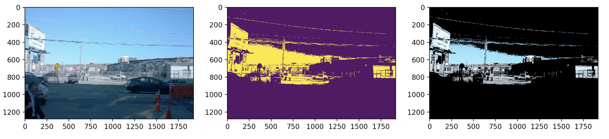

# Self-Driving Cars - Udacity

# Chapter 1 | Computer Vision
## 1 | The Machine Learning Workflow 
### Ex1 | Choosing metrics

#### Part 1 - Calculate IOU

Calculating the iou between two bounding boxes.

#### Part 2 - calculate Precision / Recall

Calculate precision and recall for a given set of predictions 
and ground truths.

### Exercise 2 - Visualization

Implementing a function to visualize the ground truth boxes
on a set of images in `visualization.py`. Displaying color coded bounding boxes using the class id associated
with each bounding box. You need to display all the data in a single figure.

### Exercise 3 - Create tf records

Converting the data from the Waymo Open Dataset into the tf record format used by the Tensorflow Object Detection API.

## 2 | Sensor and Camera calibration
### Exercise 1 | Correcting For Distortion

In this exercise we fix an image distortion. First we calibrate the camera
using the chess board method, and then we apply the distortion. 

There are two main steps to this process: use chessboard images to obtain image points and object points, 
and then use the OpenCV functions `cv2.calibrateCamera()` and `cv2.undistort()` to compute the calibration and undistortion.  

Results:

### Exercise 2 | Image manipulation

#### Part 1 - Masking

### Objective

Isolate all the pixels of a RGB image equal / higher / lower to a given color and a create a binary mask. 
And creating a masked version of the RGB image.

In the example below, we can see (from left to right), the original RGB image, the binary mask and the masked RGB image. In this example, we used a RGB color threshold of `(128, 128, 128)` and isolated all the pixels with a RGB value higher than this threshold.

### Pixel Level Transformations

### Exercise 3 - Geometric transformations

Implement the following geometric transformations
from scratch: horizontal flipping, resizing and random cropping in `augmentations.py`. 
The implementations should not only affect the images but also the associated bounding boxes. 

The `hflip` function takes the image and bounding boxes as input and performs a 
horizontal flip. For example, an object initially on the left of the image will 
end up on the right.

The `resize` function takes the image, bounding boxes and target size as input. 
It scales up or down images and bounding boxes.

The `random_crop` function takes a few additional inputs. It also needs the classes, 
the crop size and the minimum area. Let's explain these parameters:
* `crop_size` is the size of the crop. It should be smaller than the dimensions of the input image.
* `min_area` is the minimum area of a bounding boxes to be considered as an object after cropping.

Because we are cropping randomly, we may only keep a tiny portion of an object, in which
case the annotations will not be useful anymore. For example, in the image below, we may not want to keep the annotation of the cat because most of the animal's body is not visible.

## 3 | From Linear Regression To FeedForward Neural Network
### Exercise 1 - Logistic regression

Implementing:
* `softmax`: compute the softmax of a vector. This function takes as input a tensor and outputs a discrete probability distribution. 

* `cross_entropy`: calculate the cross entropy loss given a vector of predictions (after softmax) and a vector of ground truth (one-hot vector).

* `model`: takes a batch of images (stack of images along the first dimensions) and feeds it through the logistic regression model

* `accuracy`: given a vector of predictions and a vector of ground truth, calculates the accuracy.

### Exercise 2 - Custom training loop

Implement your  training and validation loops from scratch to train
the logistic model you implemented. To do so, you will also have to create an optimizer.

A training loop goes through element of the training dataset and uses it to update the model's weights.
A validation loop goes through each element of the validation dataset and uses it to calculate
the metrics (eg, accuracy). We call **epoch** an iteration of one training loop and one validation loop.

### Exercise 3 - Keras

In this exercise, we learn how to leverage the [Keras API](https://www.tensorflow.org/api_docs/python/tf/keras)
to create a small neural network.

The neural network you create should have less than 4 layers, including the output layer. This last layer should not be activated. Take the time to experiment with different architecture (number of layers, number of neurons) and see how it impacts the results.

## 4 | Image Classification With CNNs

### Exercise 1 - Pooling

Implementation of  a simplified version of the max pooling layer.

### Exercise 2 - CNN

Implementation of a CNN

### Exercise 3 - Augmentation
experiment with the [Albumentations](https://albumentations.ai/docs/) library
to perform different data augmentations. 

## 5 | Object Detection

### Exercise 1 - NMS

Implementation of the Non-Max Suppression algorithm.

### Exercise 2 - Mean Average Precision

Implementation of the Mean Average Precision (mAP) metric.

### Exercise 3 - Learning rate annealing

Implementation of two different learning rate annealing (decay)
strategies: step wise annealing and exponential annealing. 

