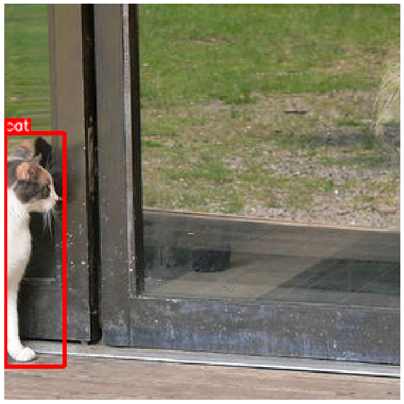

# Self-Driving Cars - Udacity

# Chapter 1 | Computer Vision
## The Machine Learning Workflow 
### Ex1 | Choosing metrics

#### Part 1 - Calculate IOU

Calculating the iou between two bounding boxes.

#### Part 2 - calculate Precision / Recall

Calculate precision and recall for a given set of predictions 
and ground truths.

### Exercise 2 - Visualization

Implementing a function to visualize the ground truth boxes
on a set of images in `visualization.py`. Displaying color coded bounding boxes using the class id associated
with each bounding box. You need to display all the data in a single figure.

### Exercise 3 - Create tf records

Converting the data from the Waymo Open Dataset into the tf record format used by the Tensorflow Object Detection API.

## Sensor and Camera calibration
### Exercise 1 | Correcting For Distortion

In this exercise we fix an image distortion. First we calibrate the camera
using the chess board method, and then we apply the distortion. 

There are two main steps to this process: use chessboard images to obtain image points and object points, 
and then use the OpenCV functions `cv2.calibrateCamera()` and `cv2.undistort()` to compute the calibration and undistortion.  

Results:

### Exercise 2 | Image manipulation

#### Part 1 - Masking

### Objective

Isolate all the pixels of a RGB image equal / higher / lower to a given color and a create a binary mask. 
And creating a masked version of the RGB image.

In the example below, we can see (from left to right), the original RGB image, the binary mask and the masked RGB image. In this example, we used a RGB color threshold of `(128, 128, 128)` and isolated all the pixels with a RGB value higher than this threshold.

### Pixel Level Transformations

### Exercise 3 - Geometric transformations

Implement the following geometric transformations
from scratch: horizontal flipping, resizing and random cropping in `augmentations.py`. 
The implementations should not only affect the images but also the associated bounding boxes. 

The `hflip` function takes the image and bounding boxes as input and performs a 
horizontal flip. For example, an object initially on the left of the image will 
end up on the right.

The `resize` function takes the image, bounding boxes and target size as input. 
It scales up or down images and bounding boxes.

The `random_crop` function takes a few additional inputs. It also needs the classes, 
the crop size and the minimum area. Let's explain these parameters:
* `crop_size` is the size of the crop. It should be smaller than the dimensions of the input image.
* `min_area` is the minimum area of a bounding boxes to be considered as an object after cropping.

Because we are cropping randomly, we may only keep a tiny portion of an object, in which
case the annotations will not be useful anymore. For example, in the image below, we may not want to keep the annotation of the cat because most of the animal's body is not visible.

